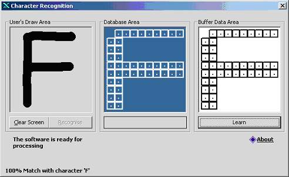



## A Artificially Intelligent Pattern Recognizer OCR

### Description

Description:

This program is a pattern recognizer that has the capability to “Learn” optical characters. It was made in Visual Basic 6 and is based on array based 2 Dimensional pattern matching algorithms. This program can be run directly by running the “textrecognition.scr” file.

Working:

The working of this program is based on an input in a paint area which is converted into a 100 element 10X10 matrix. This array is compared using brute force with a database of “learnt” characters. The character with the highest match matching attributes is displayed in the screen. In the case of a new element being inputted, the program generalizes to the pattern in its database that matches the input the most. In this case, the program can be “taught” the correct character by pressing the “Learn” button. The learnt characters area automatically saved to disk.

References:

Congratulations to albertoycc@hotmail.com

who is the actual coder of this program.
 
### More Info
 

             |
---                |---
**Submitted On**   |2002-09-24 17:23:06
**By**             |[Kamran Sethi](https://github.com/Planet-Source-Code/PSCIndex/blob/master/ByAuthor/kamran-sethi.md)
**Level**          |Intermediate
**User Rating**    |4.7 (180 globes from 38 users)
**Compatibility**  |VB 5\.0, VB 6\.0
**Category**       |[Complete Applications](https://github.com/Planet-Source-Code/PSCIndex/blob/master/ByCategory/complete-applications__1-27.md)
**World**          |[Visual Basic](https://github.com/Planet-Source-Code/PSCIndex/blob/master/ByWorld/visual-basic.md)
**Archive File**   |[Artificial1353549242002\.zip](https://github.com/Planet-Source-Code/kamran-sethi-a-artificially-intelligent-pattern-recognizer-ocr__1-39221/archive/master.zip)

